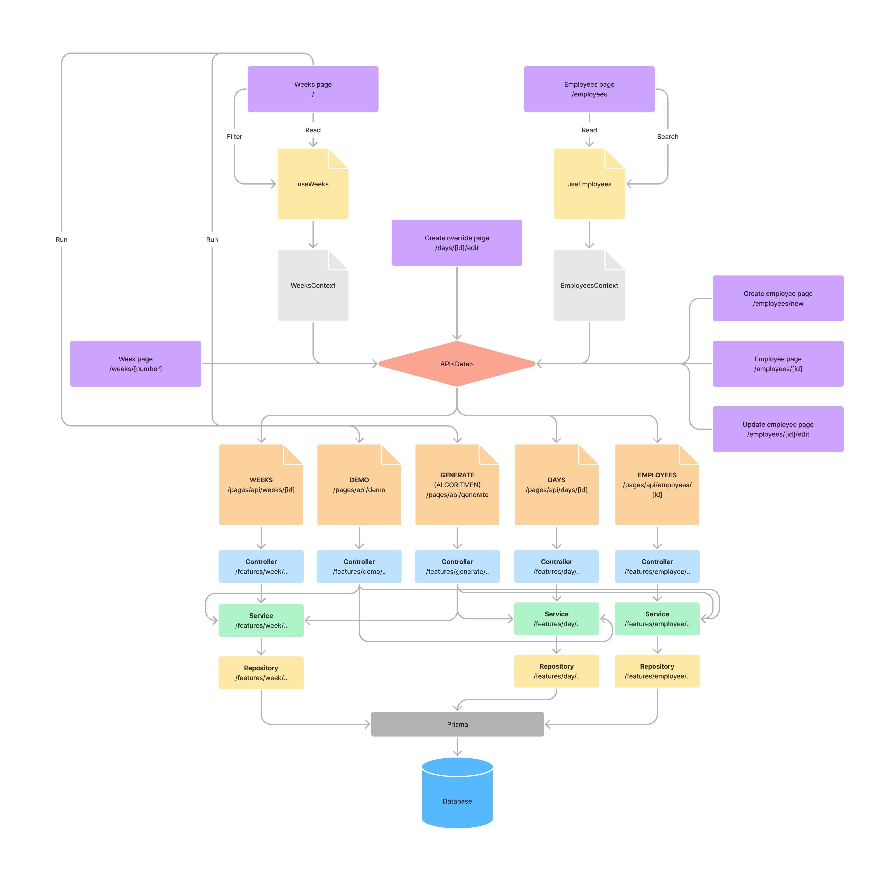

# Overview


[Diagram](https://www.figma.com/file/Y1dyZOYBwH37mUZetOqcJZ/Webapp-flow?node-id=0%3A1&t=CnjHxb64vofmWnW8-1)



# Model

## Employee

```ts
type Employee = {
  id: string
  name: string
  rules: string
  days?: Day[]
  overrides?: Day[]
}
```

## Day

```ts
type Day = {
  id: string
  name: string
  employee?: Employee | null
  employeeId: string | null
  week?: Week
  weekId: string
  override?: Employee | null
  overrideId: string | null
}
```

## Week

```ts
type Week = {
  id: string
  number: number
  days?: Day[]
}
```

# Resources

## Response

```ts
// The standard response returned from all endpoints.
// Generic "Data" is the type of data expected.
type Result<Data> = {
  status: number
  data?: Data
  error?: string
}
```

## Employee

```
👉 /api/employees

GET:
  200: Result<Employee[]>
  500: Result with error

  PARAMS:
    ?name={phrase} Employees with names containing phrase.

POST:
  201: Result<Employee>
  400: Result with error
  500: Result with error

  BODY: NewEmployee
```

Includes each day a employee is responsible for.

```
👉 /api/employees/{id}

GET:
  200: Result<Employee>
  404: Result with error
  500: Result with error

PUT:
  200: Result<Employee>
  400: Result with error
  404: Result with error
  500: Result with error

  BODY: EditEmployee
```

## Day

Add a override to a lunch day.

```
👉 /api/days/{id}

PUT:
  200: Result<Day>
  400: Result with error
  404: Result with error
  500: Result with error

  BODY: EditDay
```

## Week

Includes days and the employee assigned to each day.

```
👉 /api/weeks

GET:
  200: Result<Week[]>
  500: Result with error

  PARAMS:
    ?start={number} All weeks from week nr (incl).
    ?end={number} All weeks until week nr (incl).
    ?format=excel Download lunch plan as an excel file.
```

```
👉 /api/weeks/{number}

GET:
  200: Result<Week>
  404: Result with error
  500: Result with error
```

## Demo

Populates the database with example data.

```
👉 /api/demo

GET:
  200: Result<null>
  500: Result with error
```

## Generate

Generates a lunch list based on a configuration.

```
👉 /api/generate

GET:
  201: Result<null>
  400: Result with error
  500: Result with error
```

# Pages

## Week 

This is the home page.

```
👉 /

This page is the entry point and an overview of all weeks.

- Can navigate to an individual week (👉 /weeks/{number}).
- Can navigate to weeks overview (👉 /weeks).
- Can navigate to employee overview (👉 /employees).

- Each week can be expanded to see individual days.
  - Shows who is responsible for lunch each day.
  - Can navigate to individual employee (👉 /employees/{id}).
  - Can edit an individual day (👉 /days/{id}/edit).
- Can filter weeks in interval.
- Can generate a lunch plan based on demo data.
- Can download lunch plan as an excel file.
- Can generate a new lunch plan based on algorithm.
```

```
👉 /weeks/{number}

This page is an overview of a individual week.

- Shows an overview of all days within that week.
- Shows who is responsible for lunch each day.
```

## Employee

```
👉 /employees

This page is an overview of all employees.

- Can search for employee.
- Each employee can be expanded to see days responsible.
  - Can navigate to an individual week (👉 /weeks/{number}).
- Can choose to edit an employee (👉 /employees/{id}/edit).
- Can choose to create an employee (👉 /employees/new).
```

```
👉 /employees/{id}

This page is an overview of an individual employee.

- Can choose to edit employee (👉 /employees/{id}/edit).
```

```
👉 /employees/{id}/edit

This page is for editing an employee.
```

```
👉 /employees/new

This page is for creating a new employee.

- When done, the user is redirected (↪️ /employees/{id}).
```

## Day

```
👉 /days/{id}/edit

This page is for adding a new override.
```
